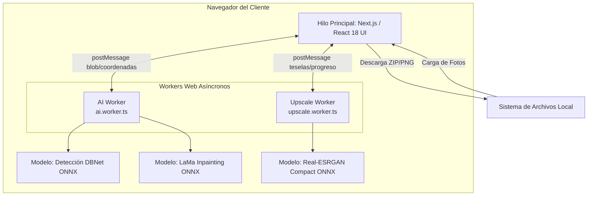

# Contexto y Arquitectura de PropApp (JotaTool v2)

Este documento detalla el contexto general, los objetivos y la arquitectura técnica de **PropApp (JotaTool v2)**, una suite profesional de edición con Inteligencia Artificial enfocada en el sector inmobiliario.

---

## 1. Contexto del Proyecto

**JotaTool v2** nace como una solución para agencias y profesionales del sector inmobiliario que necesitan procesar fotografías de propiedades con alta calidad, velocidad y estricta privacidad. 

Las fotografías inmobiliarias suelen requerir dos tipos de intervención principales:
1. **Limpieza (Inpainting):** Eliminación de marcas de agua, logotipos de portales inmobiliarios y textos intrusivos que devalúan la presentación de la propiedad.
2. **Mejora de Calidad (Super-Resolución):** Restauración de detalles y aumento de resolución (hasta 4x) en imágenes comprimidas o de baja calidad.

**El diferencial clave:** A diferencia de las soluciones basadas en la nube (SaaS), todo el procesamiento se realiza de forma **100% local en el navegador del usuario**. Esto garantiza la privacidad absoluta de las imágenes (no salen del dispositivo del usuario) y elimina los costos recurrentes de servidores de inferencia.

---

## 2. Arquitectura del Sistema

El proyecto adopta un paradigma de **Client-Side Edge AI**, ejecutando modelos de redes neuronales directamente en el navegador del cliente mediante WebAssembly (WASM) multihilo y aceleración por hardware local.

### 2.1. Diagrama de Arquitectura

### 2.2. Componentes Principales

1. **Hilo Principal (UI y Estado)**
   - Desarrollado en **Next.js 14** y **React 18**.
   - Gestiona la interfaz de usuario (Bento Grid), el lienzo interactivo (Canvas) y los comparadores de "Antes/Después".
   - Coordina el estado global, el encolamiento de lotes (Batch Processing) y la comunicación con los Web Workers.

2. **Procesamiento de Inferencia (Web Workers)**
   Para evitar bloquear la interfaz de usuario (manteniendo 60 FPS), el procesamiento pesado se aísla en hilos independientes:
   - **`ai.worker.ts`:** Encargado de la detección de texto (marcas) y el proceso de *Inpainting*. Utiliza modelos ONNX cuantizados para alta velocidad en CPU.
   - **`upscale.worker.ts`:** Se encarga de cuadruplicar la resolución usando Real-ESRGAN. Dado el alto consumo de memoria de imágenes grandes, implementa un procesamiento por teselas (*Tiling*), dividiendo la imagen en bloques solapados y fusionándolos (*Gaussian Blending*).

3. **Motor de IA (ONNX Runtime Web)**
   - Provee el entorno de ejecución para los modelos `.onnx` estáticos alojados en `/public/models/`.
   - Aprovecha WebAssembly (WASM) SIMD (Single Instruction, Multiple Data) y multithreading para acelerar la ejecución directamente sobre la CPU y GPU del cliente.

---

## 3. Stack Tecnológico

- **Framework:** [Next.js 14](https://nextjs.org/) (App Router).
- **Librería de Componentes y UI:** [React 18](https://react.dev/), [Tailwind CSS v3.4](https://tailwindcss.com/) (para utilidades de estilos), `clsx`, `tailwind-merge` y Lucide React.
- **Lenguaje:** [TypeScript 5](https://www.typescriptlang.org/) con tipado estricto en todos los niveles (estado, workers, modelos).
- **Inteligencia Artificial:** `onnxruntime-web` para la inferencia y ejecución de modelos DBNet, LaMa y Real-ESRGAN.
- **Empaquetado y Exportación:** JSZip para comprimir y exportar los lotes de fotos procesadas.

---

## 4. Flujo de Datos

1. **Entrada:** El usuario arrastra o selecciona imágenes (JPEG, PNG, WebP) desde su disco duro. Las imágenes se cargan en memoria y se dibujan en el lienzo (Canvas API).
2. **Detección Automática:** Se envía una previsualización de la imagen al AI Worker, que detecta las marcas usando DBNet y devuelve un bounding box inicial.
3. **Edición:** El usuario puede afinar la máscara generada mediante una herramienta de pincel interactivo.
4. **Procesamiento de Inpainting / Escalado:** La imagen final y su máscara se envían al Worker correspondiente como *Transferable Objects* para optimizar el rendimiento. ONNX Runtime Web procesa la petición y devuelve un Blob o Bitmap restaurado.
5. **Salida:** La imagen lista se presenta en el comparador Antes/Después y puede enviarse al módulo de súper resolución ("Enviar a 4x") o ser descargada de forma individual o conjunta en un ZIP.

## 5. Diseño y Estética
La plataforma aplica un *Design System* sobrio denominado **Jota Studio**, orientado al mercado inmobiliario y profesional. Utiliza esquemas oscuros de alto contraste (#09090b), elementos translúcidos (glassmorphism sutil) y tipografías neutras y legibles (Geist), evitando elementos visuales superfluos propios de herramientas para consumo general.
